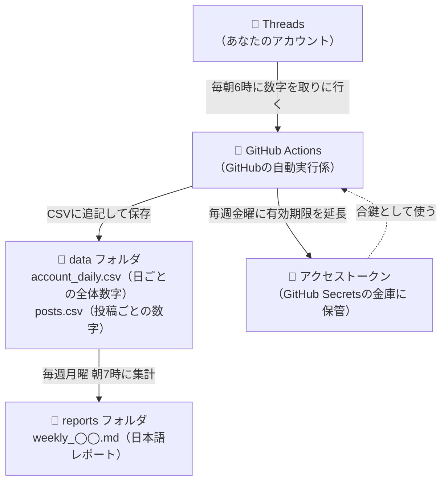

# Threads インサイト自動レポート

Threadsアカウント **@ai_hattatu.schoolsocialworker** のインサイト（閲覧数・いいね・フォロワー数など）を**毎日自動で記録**し、**毎週月曜の朝に日本語の分析レポート**を自動生成するシステムです。

一度設定すれば、あとは何もしなくても動き続けます。あなたがやることは **毎週月曜に `reports/` フォルダのレポートを読むだけ** です。

---

## 🗺️ 仕組みの図解



| いつ | 何が起きる（日本時間） |
|---|---|
| 毎日 朝6:00 | その日の閲覧数・フォロワー数・各投稿の数字を取得して `data/` に保存 |
| 毎週月曜 朝7:00 | 直近7日間の分析レポートを `reports/` に作成 |
| 毎週金曜 朝5:00 | アクセストークンの有効期限を延長（60日切れ対策） |

※ GitHubの混雑により数分〜数十分遅れることがあります。

## 📁 フォルダの中身

```
├── data/                  ← 毎日貯まる数字（さわらなくてOK）
│   ├── account_daily.csv     1日1行: 日付・フォロワー数・その日の閲覧数
│   ├── posts.csv             投稿1件1行: 本文・日時・閲覧・いいね・リプライなど
│   └── token_status.json     トークンの有効期限メモ
├── reports/               ← ⭐ 毎週月曜、ここにレポートができる
├── scripts/               ← プログラム本体（Python）
│   ├── fetch_daily.py        日次取得
│   ├── weekly_report.py      週次レポート生成
│   ├── refresh_token.py      トークン自動延長
│   └── threads_api.py        共通部品
├── .github/workflows/     ← 自動実行のスケジュール設定
├── docs/
│   ├── token_guide.md        🔑 トークンの取り方・切れたときの直し方
│   └── setup_github.md       ⚙️ GitHubの設定手順（Secrets・自動実行）
└── logs/                  ← 実行の記録（トラブル時に見る）
```

## 🚀 初回セットアップ（やることは2つだけ）

1. **アクセストークンを取得する** → [docs/token_guide.md](docs/token_guide.md)（画面操作つきガイド）
2. **GitHubに設定する** → [docs/setup_github.md](docs/setup_github.md)（Secrets登録〜動作確認〜完全自動化）

## 📖 レポート・指標の見方

| 指標 | 意味 | 目安の考え方 |
|---|---|---|
| **閲覧数（views）** | 投稿が表示された回数 | 「どれだけの人に届いたか」。おすすめ欄に乗ると跳ねる |
| **いいね（likes）** | ハートの数 | 「共感された度合い」 |
| **リプライ（replies）** | 返信の数 | 「会話が生まれた度合い」。Threadsはリプライが多いと伸びやすい |
| **リポスト（reposts）** | 再共有された数 | 「人に広めたいと思われた度合い」 |
| **引用（quotes）** | コメント付きで共有された数 | 話題の広がり |
| **シェア（shares）** | 外部への共有数 | DMやストーリーズなどでの共有 |
| **エンゲージメント率** | （いいね＋リプライ＋リポスト）÷ 閲覧数 | **見た人のうち何%が反応したか**。閲覧数が少なくてもこの率が高い投稿は「刺さっている」ので、同じテーマを深掘りする価値あり。3〜5%あればかなり良好 |
| **フォロワー増減** | 週の始めと終わりの差 | 「プロフィールまで来て応援したくなった人」の数 |

レポートには、発信テーマ（発達グレーゾーンの子の癇癪・子育て）に合わせた**テーマ別の伸び比較**（癇癪・感情／学校・園／声かけ・対応法／親のケア…）も載ります。分類キーワードは `scripts/weekly_report.py` の先頭にある `THEME_KEYWORDS` で自由に変えられます。

## 🔑 トークンが切れたとき

- 症状: GitHubに「⚠️ 日次取得が失敗しました」というIssue（お知らせ）が自動で立つ／レポートに⚠️が出る
- 対処: [docs/token_guide.md](docs/token_guide.md) の「**トークンが切れたとき**」の手順どおりに（新しいトークンを発行 → Secretsに貼り替え → 手動実行で確認）。5分で終わります
- 予防: `GH_PAT` を設定しておけば毎週自動延長されるので、基本的に切れません（[docs/setup_github.md](docs/setup_github.md) の手順5）

## ❓ 困ったときのチェックリスト

| 症状 | 見るところ |
|---|---|
| レポートが月曜にできていない | Actionsタブ → 「週次レポート生成」が❌なら、クリックしてログを見る。だいたいはデータ不足（貯まるまで待つ）かトークン切れ |
| データが増えていない | Actionsタブ → 「日次インサイト取得」の結果。60日間更新がないとGitHubが自動実行を止めることがある（Enableボタンで再開） |
| 数字がThreadsアプリの表示と少し違う | 取得タイミングの差やAPIの集計方法の違いで数%ズレることがあります。傾向を見るぶんには問題ありません |
| 何も分からなくなった | このリポジトリの内容をClaudeに見せて「このシステムの◯◯を直して」と聞けばOK。設計がREADMEに全部書いてあります |

## 🔒 セキュリティのやくそく

- アクセストークンは **GitHub Secrets**（またはMacの `.env` ファイル）にだけ置く。コードやチャットに直接書かない
- `.env` は `.gitignore` に登録済みなので、間違えてGitHubにアップロードされることはない
- このシステムが持つ権限は「**読む**」だけ（`threads_basic` / `threads_manage_insights`）。勝手に投稿されることはない
- データ用リポジトリは**非公開（Private）**にして、閲覧数などの数字を外部に見せない
