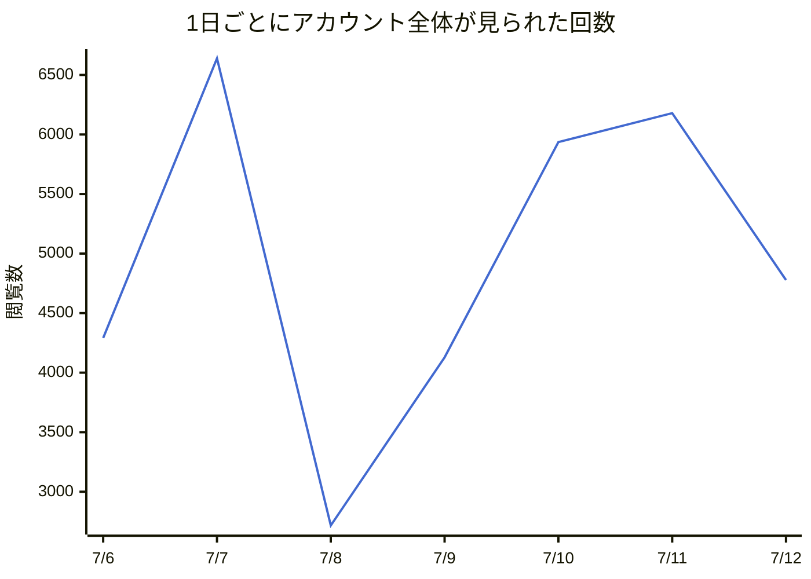
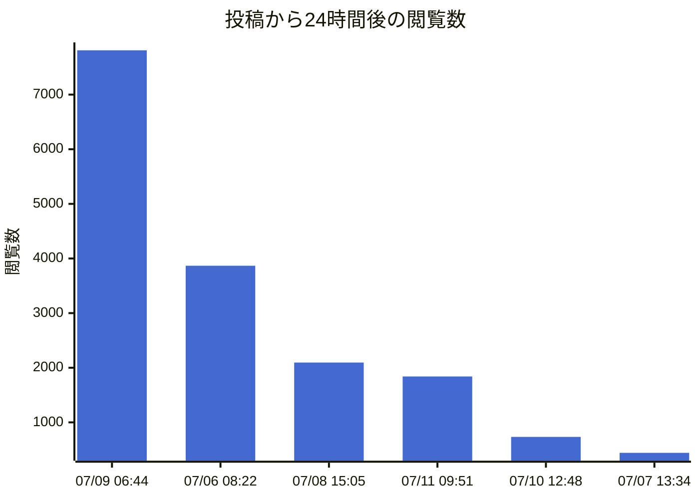
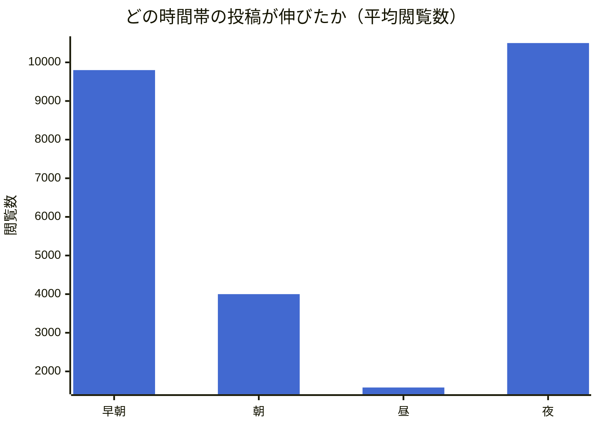
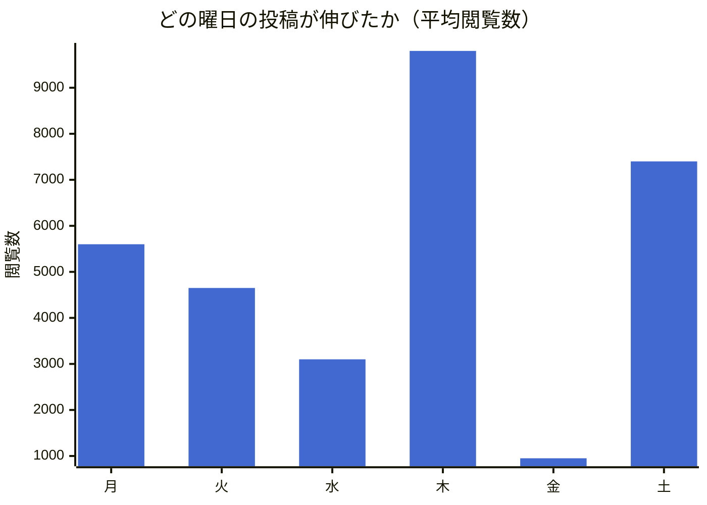
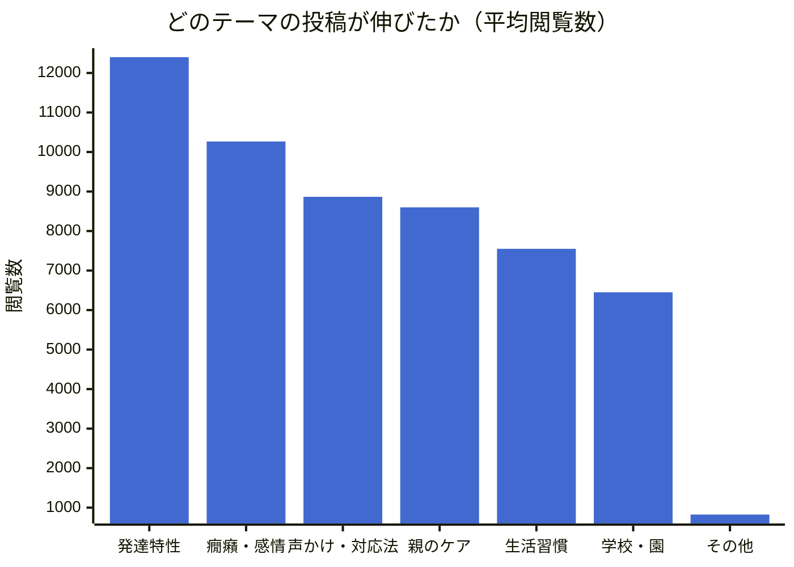

> 📌 **これはサンプルデータで作った見本です。** 実際のレポートは、本物のデータが7日ぶん貯まった後の月曜朝に reports/ フォルダに自動生成されます。グラフはGitHub上で開くと図として表示されます。

# Threads 週次レポート（2026年07月06日 〜 07月12日）

アカウント: @ai_hattatu.schoolsocialworker ／ 作成日時: 2026-08-08 22:01

## 📊 今週のサマリー

- **総閲覧数（今週の投稿8件の閲覧数合計）**: 43,550 +24,550（前週比 +129%）
- **アカウント全体の表示回数**: 34,668（取得できた7日分の合計。過去の投稿が見られた分も含むため、上の数字とは対象が異なります）
- **フォロワー数**: 1,247人（今週 +40人）（前週の増減: +25人）
- **投稿数**: 8件 +4（前週比 +100%）

### 📈 日別の閲覧数の推移（アカウント全体）



### 👥 フォロワー数の推移

```mermaid
%%{init: {"themeVariables": {"xyChart": {"plotColorPalette": "#4269d0"}}}}%%
xychart-beta
    title "フォロワー数"
    x-axis ["7/6", "7/7", "7/8", "7/9", "7/10", "7/11", "7/12"]
    y-axis "人"
    line [1207, 1210, 1219, 1227, 1235, 1238, 1247]
```

## 🏆 閲覧数トップ3の投稿

### 1位: 「「宿題やりなさい」で癇癪が始まる夜、実はこの一言が引き金になっていました。発達グ…」

- 投稿日時: 2026-07-11 21:51
- 閲覧 12,400 ／ いいね 420 ／ リプライ 63 ／ リポスト 38
- **エンゲージメント率: 4.2%**（いいね＋リプライ＋リポスト ÷ 閲覧数）
- [投稿を見る](https://www.threads.net/@ai_hattatu.schoolsocialworker/post/demo0)

### 2位: 「朝の支度でパニックになる子。時計より「見てわかる順番カード」に変えたら、登校前の…」

- 投稿日時: 2026-07-09 06:44
- 閲覧 9,800 ／ いいね 350 ／ リプライ 41 ／ リポスト 29
- **エンゲージメント率: 4.3%**（いいね＋リプライ＋リポスト ÷ 閲覧数）
- [投稿を見る](https://www.threads.net/@ai_hattatu.schoolsocialworker/post/demo1)

### 3位: 「癇癪のあと、自分を責めてしまうお母さんへ。スクールソーシャルワーカーとして伝えた…」

- 投稿日時: 2026-07-07 21:17
- 閲覧 8,600 ／ いいね 390 ／ リプライ 72 ／ リポスト 25
- **エンゲージメント率: 5.7%**（いいね＋リプライ＋リポスト ÷ 閲覧数）
- [投稿を見る](https://www.threads.net/@ai_hattatu.schoolsocialworker/post/demo2)

## ⚖️ 投稿から24時間後の閲覧数（条件を揃えた比較）

閲覧数は投稿後もずっと増え続けるので、古い投稿ほど有利に見えます。ここでは「投稿から24時間後」の時点で揃えて比べています。



| 投稿日時 | 24時間後の閲覧数 | 現在の閲覧数 | 本文の冒頭 |
|---|---|---|---|
| 2026-07-09 06:44 | 7,811 | 9,800 | 朝の支度でパニックになる子。時計より「見… |
| 2026-07-06 08:22 | 3,867 | 5,600 | ゲームをやめられない子への声かけ、「あと… |
| 2026-07-08 15:05 | 2,095 | 3,100 | 支援級と通級の違い、ざっくり説明します。 |
| 2026-07-11 09:51 | 1,840 | 2,400 | 偏食がすごい我が子。食べられた日の記録だ… |
| 2026-07-10 12:48 | 734 | 950 | 今日は暑いですね。皆さんの地域はどうです… |
| 2026-07-07 13:34 | 442 | 700 | 雑談です。コーヒー飲みながら書いてます。 |

## 🔍 伸びた投稿・伸びなかった投稿の違い

伸びた投稿（上位半分）の平均閲覧数は **9,100**、伸びなかった投稿（下位半分）は **1,787** でした。

**時間帯別の平均閲覧数**



| 時間帯 | 平均閲覧数 | 投稿数 |
|---|---|---|
| 早朝（4〜6時） | 9,800 | 1件 |
| 朝（7〜9時） | 4,000 | 2件 |
| 昼（10〜15時） | 1,583 | 3件 |
| 夜（20〜23時） | 10,500 | 2件 |

**曜日別の平均閲覧数**



| 曜日 | 平均閲覧数 | 投稿数 |
|---|---|---|
| 月 | 5,600 | 1件 |
| 火 | 4,650 | 2件 |
| 水 | 3,100 | 1件 |
| 木 | 9,800 | 1件 |
| 金 | 950 | 1件 |
| 土 | 7,400 | 2件 |

**テーマ別の平均閲覧数**（本文のキーワードから自動分類）



| テーマ | 平均閲覧数 | 投稿数 |
|---|---|---|
| 発達特性 | 12,400 | 1件 |
| 癇癪・感情 | 10,266 | 3件 |
| 声かけ・対応法 | 8,866 | 3件 |
| 親のケア | 8,600 | 1件 |
| 生活習慣 | 7,550 | 4件 |
| 学校・園 | 6,450 | 2件 |
| その他 | 825 | 2件 |

## 🧾 「型」別の傾向（これまでの記録すべてから）

投稿の記録が0件です。20件貯まると、どんな型の投稿が伸びやすいかの集計を出します。

## 💡 来週に向けた改善提案

1. **投稿時間を「夜（20〜23時）」に寄せる** — この時間帯の投稿は平均 10,500 閲覧と最も伸びています（2件の平均）。悩みを検索するママは子どもの就寝後や登校後に時間ができることが多いので、この傾向と合っているか来週も確認しましょう。
2. **反応率が高かった投稿の「書き出し」を再利用する** — トップ投稿は最初の1行で悩みの場面を言い当てています。同じ型（場面の描写→共感→具体策）で別の場面に置き換えた投稿を作ってみましょう。
3. **短すぎる投稿を減らす** — 伸びた投稿は伸びなかった投稿より本文が長め（具体的）でした。「一言つぶやき」よりも、場面が目に浮かぶ具体例つきの投稿を優先しましょう。

---
🔑 アクセストークンの残り: 約30日（60日ごとに更新が必要です）
